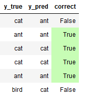
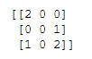
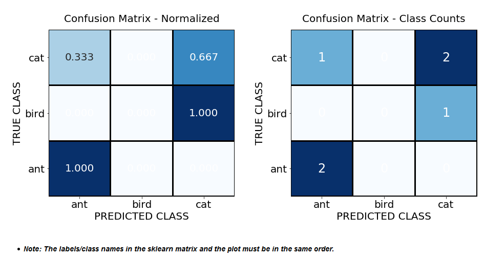
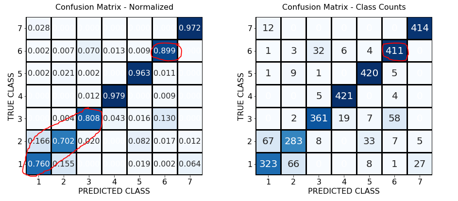

## Confusion Matrix Visualization
*Easy-to-read multiclass confusion matrix.  Shows color-coded counts and percentages.*
***
Suppose we are tuning a multiclass model that predicts three possible results: ant, bird, or cat.  The model always predicts ants accurately, but is wrong classifying birds.  How do we measure this so we can tune our model?

<ins>**True versus Predicted Class:**</ins>

The answer is a **multiclass confusion matrix**.  Scikit Learn provides a [confusion_matrix](https://scikit-learn.org/stable/modules/generated/sklearn.metrics.confusion_matrix.html) tool.  It shows the count of True categories and where they were predicted to fall.  There are three true cats.  The model predicts two of the three are cats.  The third is predicted as an ant.

For our scenario, the matrix looks like this:

<ins>**sklearn confusion_matrix:**</ins>

But, how do we read and interpret this format?  The solution is my function, which converts the matrix to heatmaps with captions!  Both a regular matrix with counts and a "normalized" matrix with decimal percentages are plotted.

In "Counts", sum the row to get the true number of a class.  There are three cats.  In "Normalized", sum the row to see the class percentages total 1.  A third of the cats are predicted to be ants; two-thirds of the cats are correctly labeled cats.
***

<ins>**Plot Confusion Matrix Function Output:**</ins>

***
### Use the function as follows:

**`plot_confusion_matrix(confusion_matrix, class_names)`**

Where confusion matrix is the sklearn confusion matrix and class_names are the class labels we used for sklearn.

Optionally, set the figure size and font size.  Otherwise, the defaults are used.

* **`figsize = (width, height)`** 
* **`fontsize = size_in_points`**

*For example:  figsize = (15,6) and fontsize = 16.*

My function is different from existing solutions in three ways.  Redundant class pairs, which are zero, are hidden along with the unneeded color bar scale (may be revealed by editing function).  The function plots both count and percentage format by default.  The value alignment issue, where numbers appear outside the matrix, is fixed.

### Advanced Use Case:
Here is a scenario where we are predicting one of seven classes: [1,2,3,4,5,6,7].  The benefit of plotting percentages and counts side-by-side is illustrated.  In "Normalized", we see Class 6 predictions are less accurate than the first glance at "Counts".  Otherwise, we have to review the whole Class 6 row in "Counts" to realize accuracy is lower.

We also see the model is weak at successfully predicting Classes 1-3.  For example, the model often predicts  the true Class 2 is Class 1 and vice-versa.

<ins>**Confusion Matrix Shows Model Tuning Issues:**</ins>

*Please contact me know if you have any feedback:  **jmackie at gmail dot com***
